[Back to main guide](../README.md)|[Next](sct.md)

___

# Login to Event Engine
Event Engine provides you an AWS environment for running this workshop.  

1. You will be given a hash code to log-in to Event Engine. Refer to the following image for a sample hash code.

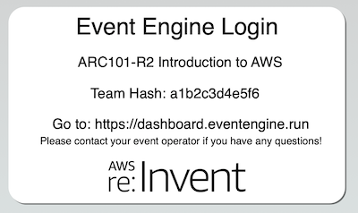

2. Navigate to [dashboard.eventengine.run](https://dashboard.eventengine.run/dashboard) and enter your hash code.

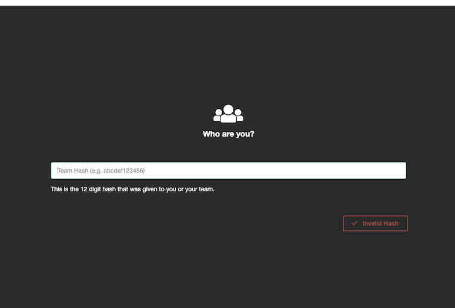

3. Click on the **AWS console** button to log-in to AWS environment.

   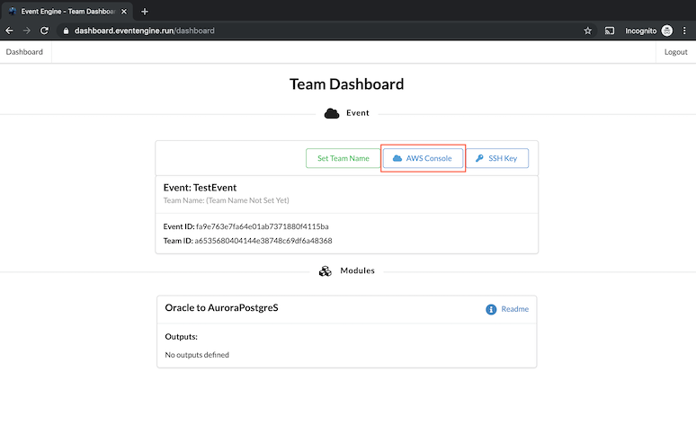

# CloudFormation Stack Outputs

The Event Engine runs the CloudFormation stack to set up following components in AWS:
- An EC2 instance with following components
   - AWS Schema Conversion Tool (SCT)
   - Source Oracle database
   - Oracle SQL Developer
   - A sample web application
- An Amazon Aurora PostgreSQL instance used as the target database

1. Go to the [AWS CloudFormation console](https://console.aws.amazon.com/cloudformation/home?region=us-east-1) and click on Stacks in the navigation panel to list CloudFormation Stacks. You should see a CloudFormation stack with name like  `mod-xxxxxxxxxxx`.

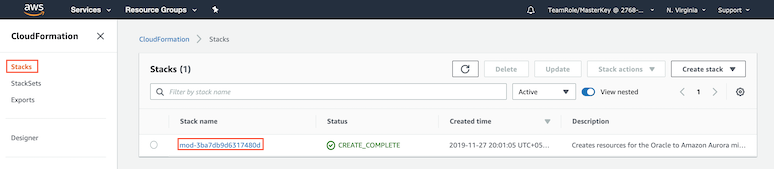

2. Click on the **Resources** tab. You will see various AWS resources created.

3. Make a note of the stack output parameters. You can find the stack output parameters in the **Outputs** tab. **You need these parameters later in the workshop.**

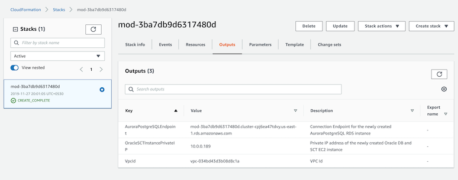
___

# Lab Setup

In this activity, we will deploy the CloudFormation template to create the lab environment.

The environment for this lab consists of:
- An EC2 instance with following components
   - AWS Schema Conversion Tool (SCT)
   - Source Oracle database
   - Oracle SQL Developer
   - A sample web application
- An Amazon Aurora PostgreSQL instance used as the target database

___

## Deploy the CloudFormation Template

1. Click on one of the buttons below to launch the CloudFormation stack in one of the AWS regions.

Region | Launch
-------|-----
US East (N. Virginia) | 
US West (Oregon) | 

2. Click **Next** on the Select Template page.

3. Enter a **Stack Name** or accept the default and click **Next**.

4. On the Options page, accept all the defaults and click **Next**.

5. On the Review page, click **Create**.

6. Click on Stacks in the navigation panel to list the CloudFormation Stacks. You should see the `DMSWorkshop` stack creation in progress.

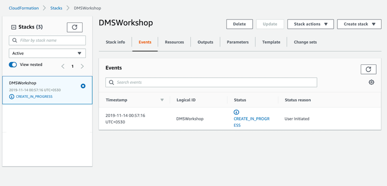

7. After the stack creation is complete, select the stack Name - `DMSWorkshop`, Click on the **Resources** tab. You will see various AWS resources created.

8. Make a note of the stack output parameters. You can find the stack output parameters in the **Outputs** tab.

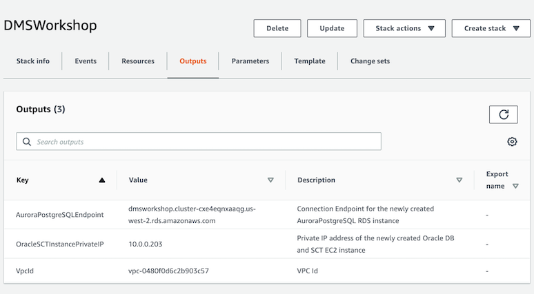

# AWS Schema Conversion Tool (SCT)

The following steps provide instructions for converting an Oracle database to an Amazon Aurora PostgreSQL database. In this activity, you perform the following tasks:
- Log in to the Windows EC2 instance (this has the AWS SCT installed)  
- Use SCT to create a database migration project
- Use SCT to convert the Oracle schema to a PostgreSQL schema and analyze schema conversion issues
- Apply the converted schema to the Aurora PostgreSQL database

    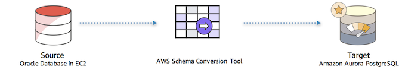
___

## Task 1 - Log in to Windows EC2 instance

1. Go to the [Amazon EC2 console](https://console.aws.amazon.com/ec2/v2/home) and click on Instances in the left column.
2. Select the instance with the name **OracleXE-SCT** and then click the **Connect** button.

    _Note : If you need instructions on connecting to a Windows instance, please see our [documentation](https://docs.aws.amazon.com/AWSEC2/latest/WindowsGuide/connecting_to_windows_instance.html?icmpid=docs_ec2_console)._

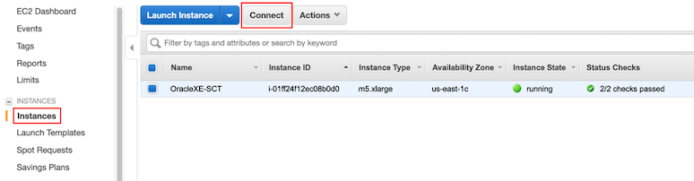

3. Click on **Download Remote Desktop File** to download the RDP file to connect to the EC2 instance **OracleXE-SCT**.
4. Connect to the EC2 instance using the following password

    **User Name**: administrator           
    **Password** : GPSreInvent@321

___

## Task 2 - Launch the Schema Conversion Tool
Now that you are connected to the EC2 instance **OracleXE-SCT**, launch the Schema Conversion Tool from the shortcut on the desktop.

1. Launch SCT from the shortcut on the desktop and create a new Database Migration Project using the tool.
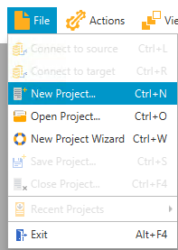
2. Enter the following values and click **OK**.

    Parameter | Value
    ----------|------
    Project Name | AWS Schema Conversion Tool Oracle to Aurora PostgreSQL
    Location | Leave default
    Database type | Transactional Database (OLTP)
    Source database engine | Oracle
    Target database engine | Amazon Aurora(PostgreSQL compatible)

    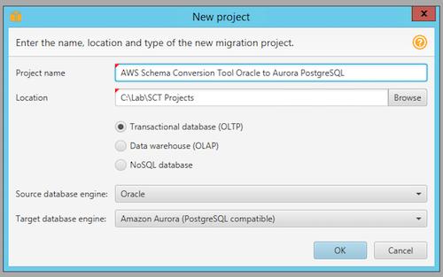

3. Click **Connect to Oracle** on the top menu bar. Enter the source database details from the below table, and click **Test Connection**. Once the connection is successfully tested, click **Ok**.

    Parameter | Value
    ----------|------
    Type | SID
    Server Name | localhost
    Server Port | 1521
    Oracle SID | XE
    User Name | hr
    Password |  hr123
    Use SSL | Unchecked
    Store Password | Checked

    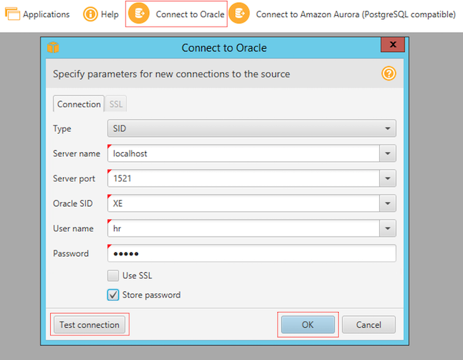

4. Click **Connect to Amazon Aurora(PostgreSQL compatible)** on the top menu bar. Enter the target database details from the below table, and click **Test Connection**. Once the connection is successfully tested, click **Ok**.

    Parameter | Value
    ----------|------
    Server Name | Get `AuroraPostgreSQLEndpoint` from [CloudFormation stack output](./lab-setup-verification.md#cloudformation-stack-outputs)
    Server Port | 5432
    Database | AuroraPostgreSQLDB
    User Name | postgres
    Password |  Aurora321
    Use SSL | Unchecked
    Store Password | Checked

    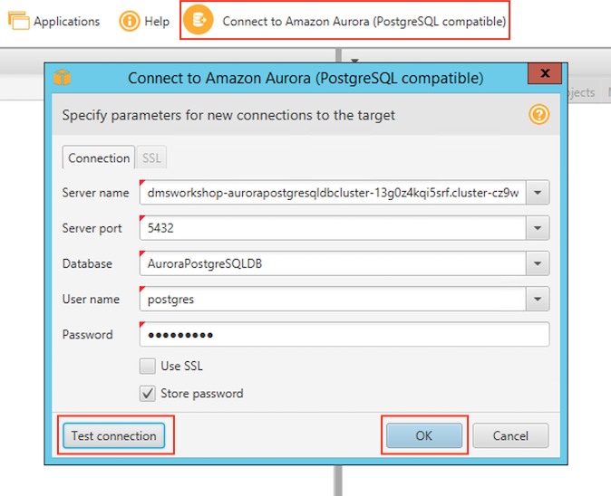

5. Select and expand the `HR` schema from the left-hand panel to inspect the schema objects.

    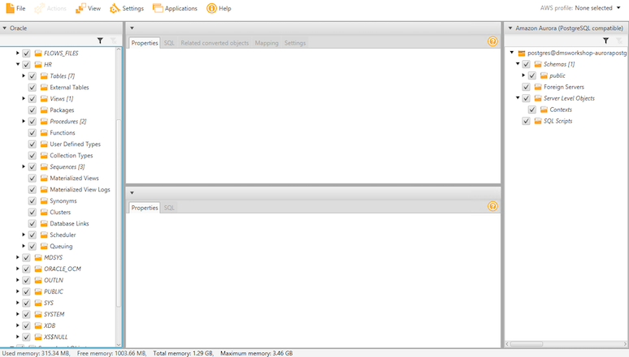
___

## Task 3 - Convert the Schema Using the Schema Conversion Tool
After creating a Database Migration Project, the next step is to convert the source Oracle schema to the target PostgreSQL schema.

1. Right-click on the `HR` schema from Oracle source and select **Convert Schema** to generate the data definition language (DDL) statements for the target database.

_Note: You may be prompted with a dialog box “These objects might already exist in the target database, Replace?” Select **Yes** and conversion will start._

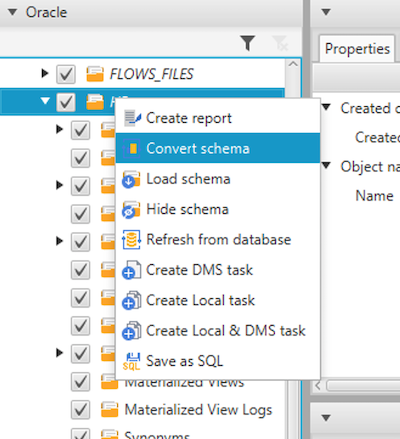

AWS SCT analyses the schema and creates a database migration assessment report for the conversion to PostgreSQL. Items with a red exclamation mark next to them cannot be directly translated from the source to the target. In this case, it includes the SECURE_DML and ADD_JOB_HISTORY procedures, and the EMP_DETAILS_VIEW view.

2. Click on the **View** button, and choose **Assessment Report view** to view the detailed assessment report.

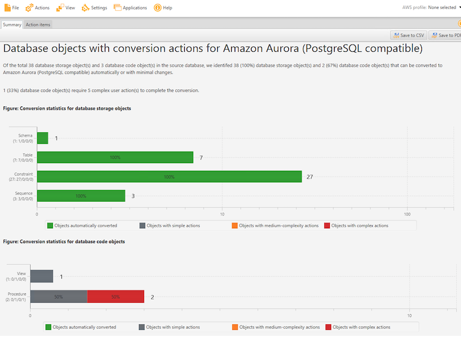    

3. Review the assessment report and check if there are any suggested actions to address schema conversion issues.

4. Next, navigate to the **Action Items** tab in the report to see the items that have issues while converting to the new PostgreSQL schema.

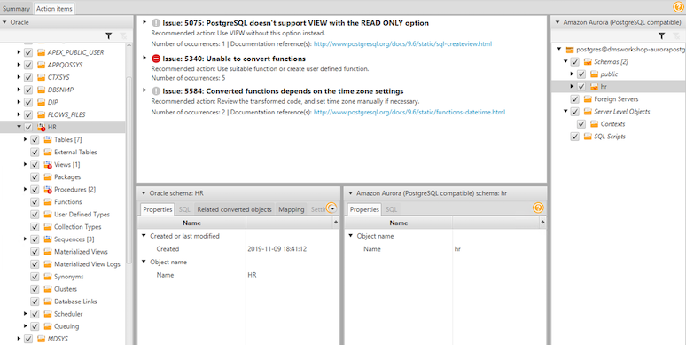

5. Check each of the issues listed and compare the contents under the source Oracle panel and the target Aurora PostgreSQL panel. SCT has proposed resolutions by generating equivalent PostgreSQL DDL to convert the objects. Additionally, SCT highlights each conversion issue where it cannot automatically generate a conversion, and provide hints on how you can successfully convert the database object.

Notice the issue highlighted in the procedure `ADD_JOB_HISTORY`. You will see that SCT is unable to automatically convert the procedure. Ignore these issues for now. We will take a look at fixing these issues towards the end of the workshop in activity [Resolving SCT action items](https://github.com/aws-samples/amazon-aurora-database-migration-workshop-reinvent2019/blob/master/lab-guides/optional-resolv.md).  

6. To migrate the converted schema to the target database, right click on the `HR` schema in the right-hand panel, and select **Apply to database**.

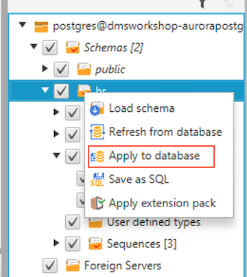

7. When prompted if you want to apply the schema to the database, click **Yes**.
8. At this point, the schema has been applied to the target database. Expand the `HR` schema to see the tables.

    _Note: If you don’t see the tables, right click on `HR` schema and select **Refresh from Database**._

9. Save the SCT project by clicking on File-> Save project.

### Conclusion

This part of the workshop demonstrated how to convert and migrate the schema from an Oracle database to an Amazon Aurora PostgreSQL database. The AWS Schema Conversion Tool (SCT) automates the schema conversion to a large extent. These same steps can be followed to migrate SQL Server and Oracle workloads to other Amazon RDS engines including Aurora MySQL and MySQL.
